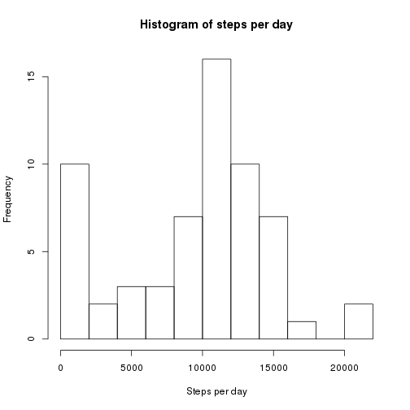
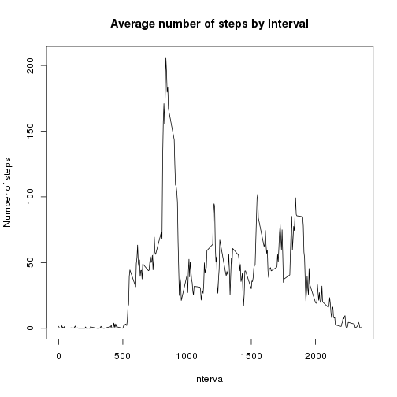
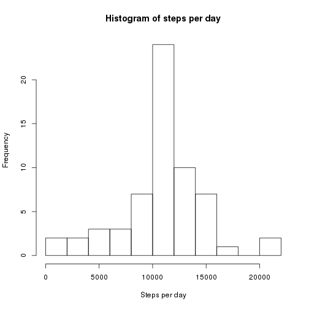
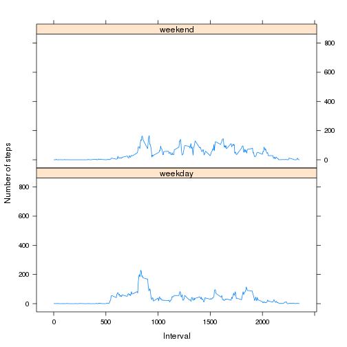

## Loading and preprocessing the data


```r
if(!file.exists("activity.csv"))
        unzip("activity.zip")
origData <- read.csv("activity.csv", header=TRUE, na.strings="NA")
origData$steps <- as.integer(origData$steps)
origData$interval <- as.integer(origData$interval)
origData$date <- as.Date(origData$date, "%Y-%m-%d")
rowCount <- prettyNum(nrow(origData), big.mark=",")
```

Successfully loaded 17,568 rows of data.

## What is mean total number of steps taken per day?


```r
stepsPerDay <- tapply(origData$steps, origData$date, sum, na.rm=TRUE)
stepMean <- prettyNum(as.integer(mean(stepsPerDay)), big.mark=",")
stepMedian <- prettyNum(median(stepsPerDay), big.mark=",")
hist(stepsPerDay, breaks=10, xlab="Steps per day",
     main="Histogram of steps per day")
```

 

The mean is 9,354 steps per day and the median is 10,395 steps per day.

## What is the average daily activity pattern?


```r
averageDailyActivity <- tapply(origData$steps, origData$interval,
                               mean, na.rm=TRUE)
maxInterval <- names(which.max(averageDailyActivity))
maxSteps <- as.integer(max(averageDailyActivity))
interval <- unique(origData$interval)
plot(interval, averageDailyActivity, type = "l",
     xlab="Interval", ylab="Number of steps",
     main="Average number of steps by Interval")
```

 

The interval with the maximum average number of steps is 835, which had 206 steps on average.

## Inputing missing values


```r
naCount <- prettyNum(nrow(subset(origData, is.na(steps))), big.mark=",")
data <- origData
averagesToUse <- as.character(data$interval[is.na(data$steps)])
data$steps[is.na(data$steps)] <- as.integer(averageDailyActivity[averagesToUse])
newStepsPerDay <- tapply(data$steps, data$date, sum)
newMean <- prettyNum(as.integer(mean(newStepsPerDay)), big.mark=",")
newMedian <- prettyNum(median(newStepsPerDay), big.mark=",")
hist(newStepsPerDay, breaks=10, xlab="Steps per day",
     main="Histogram of steps per day")
```

 

There were originally 2,304 rows with NA values provided. After filling those in with the mean for their interval, the new mean is 10,749 steps per day and the new median is 10,641 steps per day. Filling in those missing values improved these summary estimates.

## Are there differences in activity patterns between weekdays and weekends?


```r
w <- weekdays(data$date) != "Sunday" & weekdays(data$date) != "Saturday"
data$weekday <- factor(w, levels=c(TRUE, FALSE), labels=c("weekday", "weekend"))
library(lattice)
xyplot(steps ~ interval | weekday, data=data, type="l", 
       layout=c(1,2), xlab="Interval", ylab="Number of steps",
       panel = function(x, y, ...) {
                      t <- tapply(y, x, mean)
                      panel.xyplot(unique(x), t, ...)
               })
```

 
